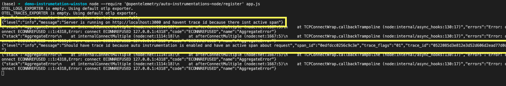

# OpenTelemetry & Winston Trace ID Demo

This demo shows how to include `traceId` in Winston logs using OpenTelemetry auto-instrumentation for HTTP requests.

## Setup

1. Install dependencies:

```bash
npm install
```
2. Run with auto-instrumentation:
```bash
node --require '@opentelemetry/auto-instrumentations-node/register' app.js
```
## Expected Logs

Startup Log: Logs without traceId.
Request Log: Logs with traceId due to active HTTP span.

### Note on Expected Errors

You may see `ECONNREFUSED` errors in the console output, as OpenTelemetry is configured here only to capture the `traceId` and `spanId` in logs without connecting to an external collector. These errors can be ignored in this setup since the primary goal is to verify the presence of the `traceId` in log entries for testing purposes. 

This configuration is intended for local development and testing and does not send telemetry data to any server.

